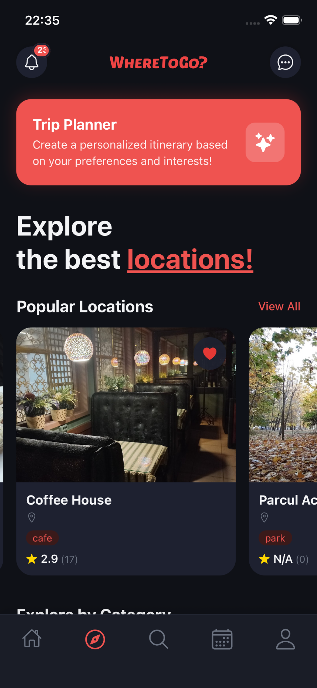
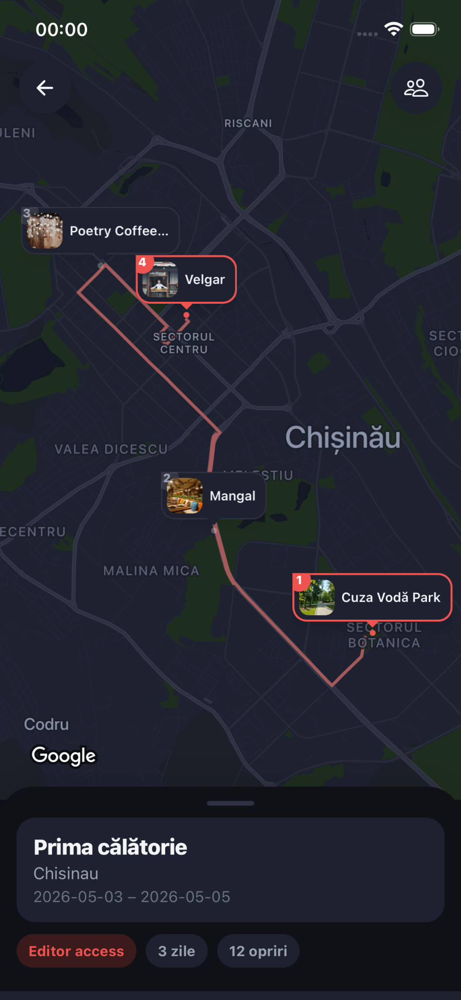
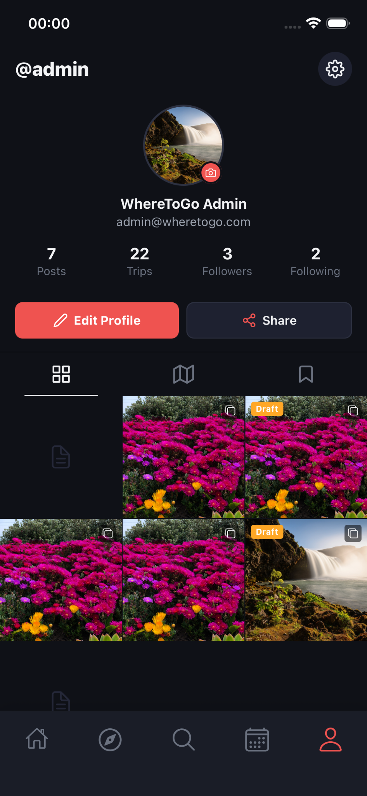

<div align="center">

# 🌍 WhereToGo

**A full-stack travel & social app that helps you discover places, plan trips automatically, and share the journey.**

Built as a bachelor's thesis project, focused on Moldova (Chișinău).

[](https://nestjs.com/)
[](https://graphql.org/)
[](https://www.prisma.io/)
[](https://www.postgresql.org/)
[](https://expo.dev/)
[](https://reactnative.dev/)
[](https://www.typescriptlang.org/)

</div>

---

## 📸 Screenshots

<div align="center">

|                        Feed                        |                        Explore                        |                     Trip Itinerary                      |
| :------------------------------------------------: | :---------------------------------------------------: | :-----------------------------------------------------: |
|  |  |  |
|                        Chat                        |                        Profile                        |                                                         |
|                                                    |     |    |

</div>

---

## ✨ Features

### 🗺️ Smart Trip Planner

Generate a complete, day-by-day itinerary for a city from just your preferences (dates, budget, interests). The planner runs a multi-stage pipeline:

- **Geo-clustering** — k-means++ groups attractions into one cluster per day to minimize travel
- **Meal-anchored day skeleton** — morning attraction → café → lunch → afternoon → dinner → bar
- **2-opt route refinement** — optimizes the walking/driving order while preserving meal timing
- **Chained timing & transport inference** — arrival times computed from real (Haversine) travel distance, with opening-hours filtering
- **Drag-to-reorder** stops with optimistic updates

### 📍 Discovery

- Browse and search **locations** imported from Google Places (Moldova region)
- Interactive **map view** and rich destination pages with photos, ratings, and opening hours
- **Favorites** and personalized recommendations (popularity, rating, geo scoring)

### 📱 Social Feed

- Create **posts** with photos/videos, like, comment, and follow other users
- Personalized feed with real-time updates

### 💬 Real-time Chat

- One-to-one and group **messaging** over GraphQL subscriptions (WebSockets)
- **Push notifications** via Firebase

### 👤 Accounts

- Email/password **auth** with JWT, plus **Google OAuth**
- Editable profiles, bookings, calendar, and notifications

---

## 🏗️ Architecture

```
wheretogo-app/
├── wheretogo-backend/wheretogo-backend/   # NestJS API
└── wheretogo-frontend/wheretogo/          # Expo / React Native app
```

> ⚠️ The code lives in **doubly-nested** directories — make sure you `cd` into the inner folder.

### Backend — `wheretogo-backend/wheretogo-backend/`

|                 |                                                                                           |
| --------------- | ----------------------------------------------------------------------------------------- |
| **Framework**   | NestJS 11                                                                                 |
| **API**         | GraphQL-first (Apollo Server + type-graphql); CRUD auto-generated by `typegraphql-prisma` |
| **Database**    | PostgreSQL via Prisma 5                                                                   |
| **Real-time**   | Redis pub/sub + `graphql-ws` subscriptions                                                |
| **Storage**     | MinIO (S3-compatible) for media                                                           |
| **Auth**        | JWT + Passport, Google OAuth                                                              |
| **Push**        | Firebase Admin                                                                            |
| **Data source** | Google Places API (New) import jobs                                                       |

### Frontend — `wheretogo-frontend/wheretogo/`

|               |                                                      |
| ------------- | ---------------------------------------------------- |
| **Framework** | Expo Router (SDK 54), React Native 0.81, React 19    |
| **Data**      | Apollo Client + GraphQL WS subscriptions             |
| **State**     | Zustand                                              |
| **Maps**      | `react-native-maps`                                  |
| **Forms**     | React Hook Form + Zod                                |
| **UI**        | Reanimated 4, Gesture Handler, Expo Image/Video/Blur |

---

## 🚀 Getting Started

### Prerequisites

- Node.js 20+
- PostgreSQL
- Redis
- MinIO (or any S3-compatible storage)
- A Google Places API key & Firebase service account (for full functionality)

### 1. Backend

```bash
cd wheretogo-backend/wheretogo-backend
npm install

# create a .env file (DATABASE_URL, JWT_SECRET, REDIS_*, MINIO_*, GOOGLE_*, FIREBASE_* ...)
npx prisma migrate dev      # apply schema
npx prisma db seed          # optional seed data

npm run start:dev           # http://localhost:8080/graphql
```

Import places from Google (server must be running):

```bash
npm run import:google
```

### 2. Frontend

```bash
cd wheretogo-frontend/wheretogo
npm install
npx expo start              # then press i / a, or scan the QR with Expo Go
```

Point the app at your backend by configuring the API URL in `src/config` / `src/services/apiService.ts`.

---

## 🧪 Scripts

**Backend**
| Command | Description |
|---|---|
| `npm run start:dev` | Start API in watch mode |
| `npm run build` | Production build |
| `npm test` | Run unit tests (Jest) |
| `npm run import:google` | Import locations from Google Places |
| `npm run clear:google` | Clear imported locations |

**Frontend**
| Command | Description |
|---|---|
| `npx expo start` | Start the dev server |
| `npm run android` / `npm run ios` | Run on a device/emulator |

---

## 🛠️ Tech Stack

**Backend:** NestJS · GraphQL (Apollo + type-graphql) · Prisma · PostgreSQL · Redis · MinIO · JWT · Firebase

**Frontend:** Expo · React Native · React 19 · Apollo Client · Zustand · React Native Maps · Reanimated

---

## 📄 License

This project was developed as a bachelor's thesis and is provided for educational and portfolio purposes.

<div align="center">

Made with ❤️ in Chișinău, Moldova

</div>
